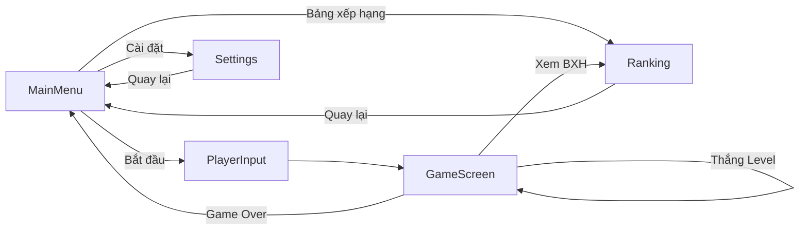
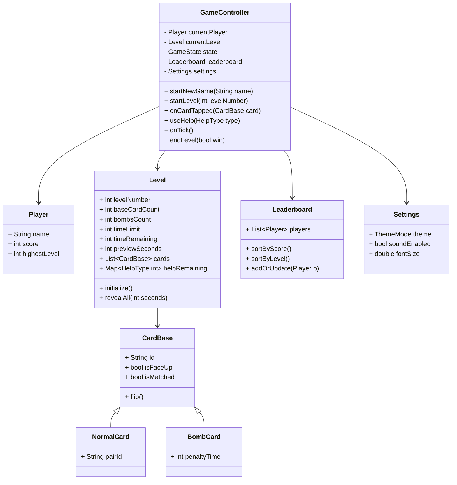
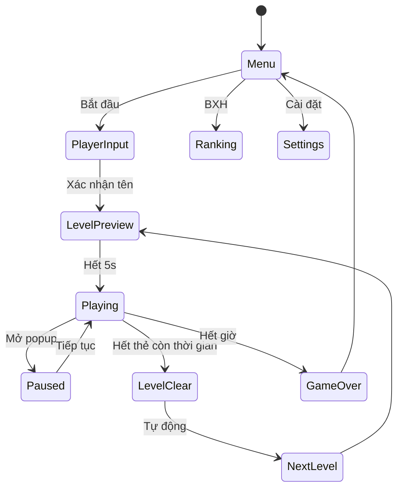

# ĐỀ TÀI:  Game Lật Thẻ Ghi Nhớ (Thiết kế & Phát triển OOP với Dart/Flutter)

---

## 1. Tổng quan đề tài

- **Mục tiêu:** Xây dựng game lật thẻ “” với gameplay ghi nhớ, giao diện tối ưu (Dark/Light), hiệu ứng và âm thanh sinh động, nhiều level, bomb, trợ giúp, bảng xếp hạng, cá nhân hóa trải nghiệm.
- **Nền tảng:** Flutter (Dart), hướng tới Android/iOS, có thể mở rộng Web/Desktop.
- **Đối tượng người dùng:** Người chơi casual, học sinh, sinh viên, mọi lứa tuổi muốn rèn trí nhớ, giải trí nhẹ nhàng.
- **Phạm vi:** Gameplay cốt lõi, 10 level, bomb tăng dần, 3 loại trợ giúp, lưu điểm cục bộ, có thể mở rộng cloud/online.

---

## 2. Tóm tắt yêu cầu chức năng

- **Menu chính:** Logo , nền động, 3 nút: Bắt đầu, Bảng xếp hạng, Cài đặt.
- **Màn nhập tên:** Textbox bắt buộc, lưu tên, bắt đầu từ Level 1.
- **Màn chơi:** 
  - Top bar: Tên, Level, Điểm, Đồng hồ.
  - Lưới thẻ PNG (4–20 thẻ), bomb từ Level 4.
  - Preview 5s, lật 2 thẻ: đúng cặp → ẩn, sai → úp lại, bomb → trừ thời gian.
  - Trợ giúp: +10s, mở toàn bộ, xóa bomb (3/lv).
  - Thời gian: L1=30s, mỗi level +8s.
  - Điểm: đúng/sai, tốc độ, combo.
- **Bảng xếp hạng:** Theo điểm, theo level.
- **Cài đặt:** Theme Dark/Light, âm thanh, font size.
- **Hiệu ứng/âm thanh:** Flip, success/fail, bomb, popup Game Over.

---

## 3. Phạm vi kỹ thuật & giả định

- **SDK/IDE:** Flutter 3.x, Dart 3.x, VS Code/Android Studio.
- **Thiết bị:** Android API 21+, iOS 13+, Web (sau).
- **State:** Provider/ChangeNotifier.
- **Lưu trữ:** shared_preferences (cài đặt), Hive hoặc JSON (leaderboard).
- **Âm thanh:** audioplayers. Ảnh PNG trong assets/.
- **Test:** flutter_test, mocktail.

---

## 4. Kiến trúc tổng thể

- **Pattern:** MVVM nhẹ + OOP.
  - Models: Player, Level, CardBase (NormalCard, BombCard), Settings, Leaderboard.
  - Controllers: GameController, SettingsController, LeaderboardController.
  - Views: MainMenuScreen, PlayerInputScreen, GameScreen, RankingScreen, SettingsScreen.
  - Services: AudioService, StorageService, ThemeService, TimerService.
- **Luồng dữ liệu:** View → Controller → Model → notifyListeners → View.
- **Routing:** Navigator.push/pop.

---

## 5. Use Cases chính

- UC1: Bắt đầu trò chơi (MainMenu → PlayerInput → GameScreen).
- UC2: Chơi 1 level (Preview → Lật thẻ → Thắng/Thua).
- UC3: Dùng trợ giúp (giới hạn/lv).
- UC4: Xem bảng xếp hạng.
- UC5: Cài đặt cá nhân hóa.

---

## 6. Mô hình lớp (OOP)

---

## 7. Thiết kế màn hình (UI/UX)

- **MainMenu:** Logo, nền động, 3 nút lớn.
- **PlayerInput:** Nhập tên, xác nhận.
- **GameScreen:** Top bar, lưới thẻ, trợ giúp, popup kết quả.
- **Ranking:** 2 tab, danh sách người chơi.
- **Settings:** Đổi theme, âm lượng, font.
- **Accessibility:** Font scalable, màu tương phản, haptic feedback.

---

## 8. Quy tắc level, bomb, trợ giúp, thời gian, điểm

- Level: 4–20 thẻ, tăng dần; bomb từ L4, mỗi 2 level +1 bomb.
- Preview: 5s đầu mỗi level.
- Thời gian: 30s + 8s*(level-1).
- Điểm: đúng +100, combo +20*n, sai -10, thắng thưởng thời gian.
- Trợ giúp: mỗi loại tối đa 1–3/lv, áp chế tài đúng mô tả.

---

## 9. Luồng hoạt động & state machine

---

## 10. Thuật toán & dữ liệu

- Khởi tạo level: tính số thẻ, bomb, sinh cặp, thêm bomb, shuffle.
- Xử lý lật thẻ: kiểm tra cặp, bomb, cập nhật trạng thái, điểm, combo.
- Trợ giúp: kiểm tra quota, áp hiệu ứng, cập nhật UI.
- Đồng hồ: giảm thời gian mỗi giây, hết giờ → GameOver.

---

## 11. Dịch vụ hạ tầng

- **AudioService:** Quản lý phát âm thanh, tắt/mở.
- **StorageService:** Lưu/đọc Settings, Leaderboard.
- **ThemeService:** Quản lý ThemeMode, ảnh nền.
- **TimerService:** Quản lý đồng hồ nếu tách rời controller.

---

## 12. Lưu trữ

- Player: `{name, score, highestLevel}`
- Leaderboard: `List<Player>`
- Settings: `{theme, soundEnabled, fontSize}`

---

## 13. Kiểm thử

- Unit test: logic thẻ, bomb, trợ giúp, điểm.
- Widget test: render màn hình, thao tác cơ bản.
- Integration: flow hoàn chỉnh từ menu đến GameOver.

---

## 14. Kế hoạch phát triển

- Giai đoạn 1: Khung dự án, cấu trúc thư mục.
- Giai đoạn 2: Models, Controller.
- Giai đoạn 3: UI, Service, Test.
- Giai đoạn 4: Hoàn thiện, tối ưu, đóng gói.

---

## 15. Tài liệu tham khảo

- Flutter: https://docs.flutter.dev  
- Dart: https://dart.dev/guides  
- Sách, diễn đàn, StackOverflow, Github Flutter.

---

## 16. Phụ lục

- Hình ảnh giao diện, sơ đồ, bảng biểu.
- Hướng dẫn cài đặt, chạy, kiểm thử.
- Mã nguồn mẫu, cấu hình pubspec.yaml.

---

