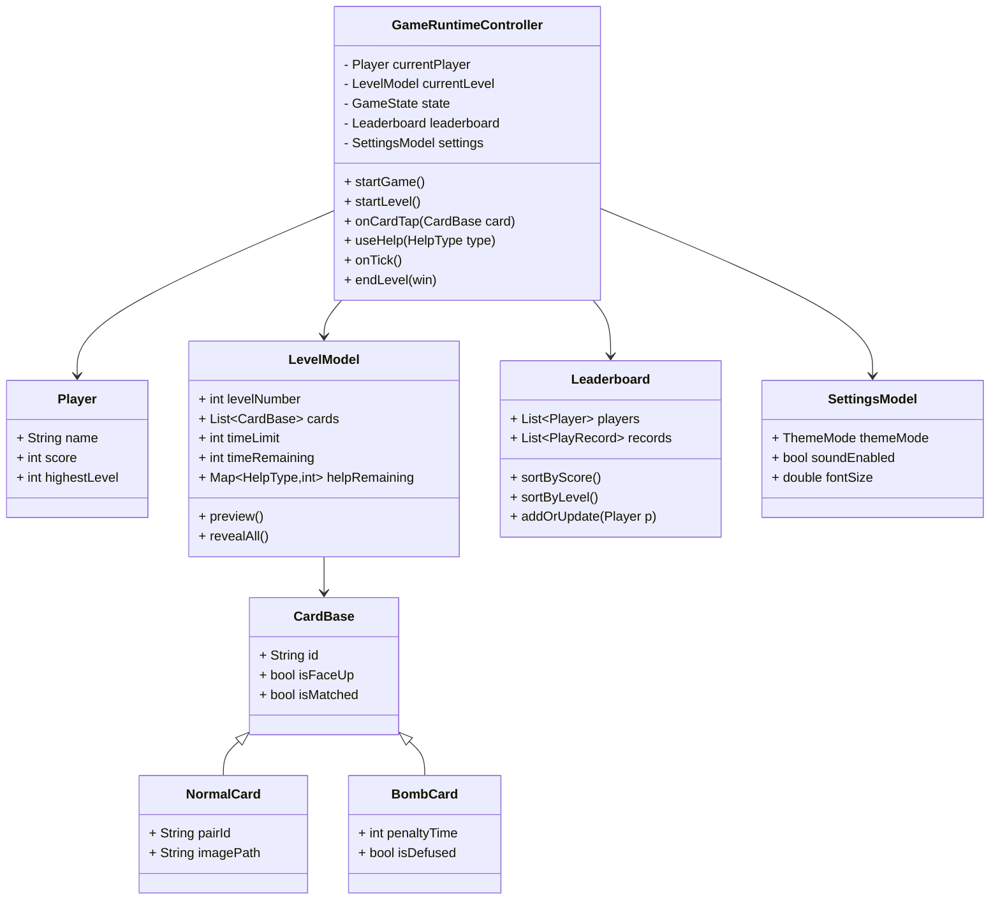

# Bậc Thầy Trí Tuệ 

---

## MỤC LỤC

1. Giới thiệu dự án  
2. Tính năng nổi bật  
3. Kiến trúc & Nguyên lý OOP  
4. Mô hình lớp & luồng hoạt động  
5. Hướng dẫn cài đặt & chạy  
6. Bảng xếp hạng & cài đặt  
7. Kiểm thử & đóng góp  
8. Tài liệu tham khảo  
9. Phụ lục  

---

## 1. Giới thiệu dự án

**Bậc Thầy Trí Tuệ** là trò chơi lật thẻ ghi nhớ phát triển bằng Flutter/Dart, hướng tới trải nghiệm mượt mà, giao diện hiện đại, đa nền tảng (Android/iOS/Web). Game giúp rèn luyện trí nhớ, phản xạ, phù hợp mọi lứa tuổi.

- **Mục tiêu:**  
  - Cung cấp gameplay lật thẻ thử thách trí nhớ với nhiều cấp độ, bomb, trợ giúp.
  - Cá nhân hóa trải nghiệm: theme, âm thanh, font, bảng xếp hạng.
- **Đối tượng:** Người chơi casual, học sinh, sinh viên, gia đình.

---

## 2. Tính năng nổi bật

- **Gameplay ghi nhớ thẻ:** Lật cặp, tránh bomb, chạy đua thời gian.
- **Âm thanh đa nền tảng:** SoundManager đồng bộ âm lượng, nhạc nền, hiệu ứng.
- **Bảng xếp hạng & lịch sử:** Leaderboard, PlayRecord lưu kết quả, hiển thị top.
- **Trợ giúp:** Thêm thời gian, mở toàn bộ thẻ, vô hiệu hóa bomb.
- **Cá nhân hóa:** Đổi theme sáng/tối, chỉnh âm thanh, cỡ chữ.
- **Lưu trữ local:** SharedPreferences lưu dữ liệu người chơi, cài đặt.

---

## 3. Kiến trúc & Nguyên lý OOP

- **Encapsulation:** Giấu chi tiết triển khai, expose API cần thiết.
- **Inheritance:** CardBase → NormalCard/BombCard, dễ mở rộng.
- **Polymorphism:** List<CardBase> chứa nhiều loại card, xử lý chung.
- **Abstraction:** LevelBuilder che giấu công thức sinh level.
- **Composition:** Controller chứa nhiều model (settings, leaderboard).

**Mẫu thiết kế:**  
- Singleton: Session, SoundManager, ThemeNotifier.  
- Factory: LevelBuilder.  
- Observer: ThemeNotifier, SettingsNotifier.

---

## 4. Mô hình lớp & luồng hoạt động

### a) Mô hình lớp (Mermaid UML)



### b) Luồng hoạt động chính

1. Đăng nhập/Đăng ký → Menu → Nhập tên → Chơi game → Xem điểm/xếp hạng → Cài đặt
2. Chơi game: lật thẻ, dùng trợ giúp, tránh bomb, thắng/thua → lưu kết quả

---

## 5. Hướng dẫn cài đặt & chạy

### 5.1 Yêu cầu hệ thống

- Flutter SDK ≥ 3.0.0
- Dart ≥ 3.0.0
- IDE: VS Code (Flutter extension) hoặc Android Studio/IntelliJ

### 5.2 Cài đặt phụ thuộc

```bash
flutter pub get
```

### 5.3 Chạy ứng dụng

```bash
flutter run
# Hoặc build web
flutter run -d chrome
```

### 5.4 Kiểm thử

```bash
flutter test
```

---

## 6. Bảng xếp hạng & cài đặt

- **Leaderboard:** Hai tab: điểm cao nhất, level cao nhất.  
- **Cài đặt:** Đổi theme, âm thanh, font size.  
- **Lưu trữ:** SharedPreferences/Hive đảm bảo dữ liệu bền vững.

---

## 7. Kiểm thử & đóng góp

- **Unit test:** Kiểm tra logic thẻ, bomb, trợ giúp, điểm.
- **Widget test:** Render màn hình, thao tác UI.
- **Integration test:** Flow hoàn chỉnh từ menu đến Game Over.
- **Đóng góp:** Fork, tạo branch, mô tả rõ Pull Request, ưu tiên comment tiếng Việt ngắn gọn.

---

## 8. Tài liệu tham khảo

1. Flutter: https://docs.flutter.dev  
2. Dart: https://dart.dev/guides  
3. Sách "Flutter for Beginners" – Alessandro Biessek  
4. Sách "Object-Oriented Programming with Dart" – Sanjib Sinha  
5. https://stackoverflow.com/questions/tagged/flutter  
6. https://github.com/flutter/flutter  

---

## 9. Phụ lục

### 9.1 Hình ảnh minh họa

- Giao diện đăng nhập, menu, nhập tên, chơi game, bảng xếp hạng, cài đặt, hiệu ứng lật thẻ, thắng/thua.
- Sơ đồ luồng hoạt động, sơ đồ quan hệ giữa các lớp.

### 9.2 Bảng biểu, sơ đồ

- Bảng cấu trúc các class chính, bảng thông số các level, bảng chức năng từng màn hình.

### 9.3 Mã nguồn mẫu (trích đoạn)

- Định nghĩa các lớp CardBase, NormalCard, BombCard (mô tả logic).
- Quy trình sinh bộ thẻ, xáo trộn, kiểm tra ghép cặp.
- Cách quản lý điểm số, lưu lịch sử chơi, cập nhật bảng xếp hạng.

### 9.4 Hướng dẫn đóng góp, liên hệ

- Hướng dẫn đóng góp mã nguồn, báo lỗi, đề xuất tính năng mới qua Github/Pull Request.
- Email liên hệ tác giả nếu muốn hợp tác, sử dụng thương mại.

---

