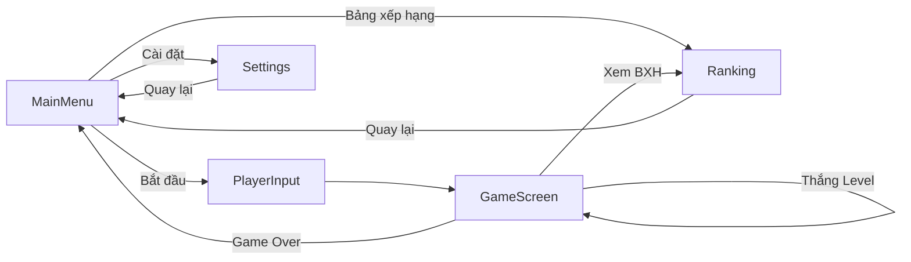
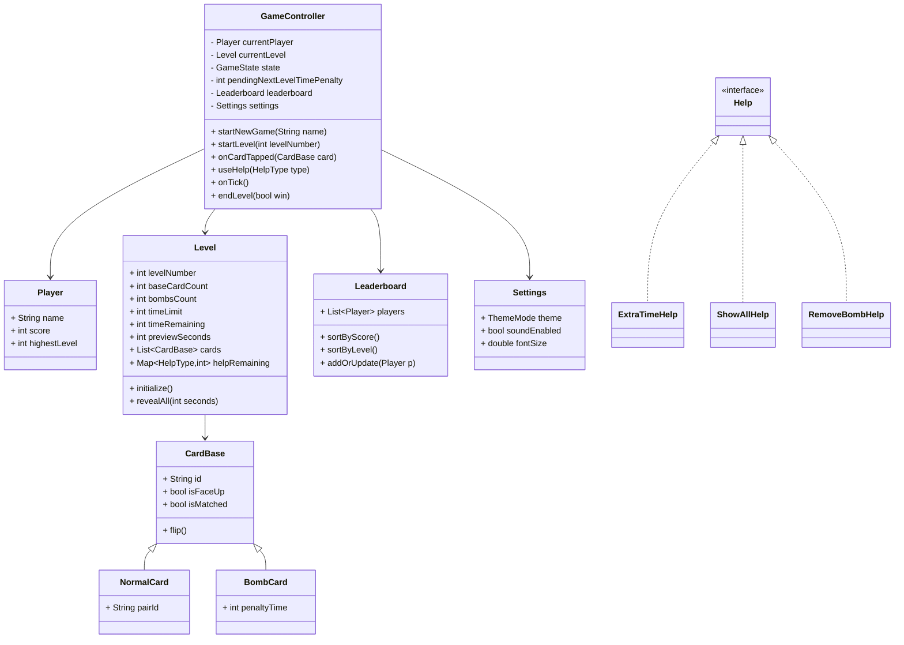
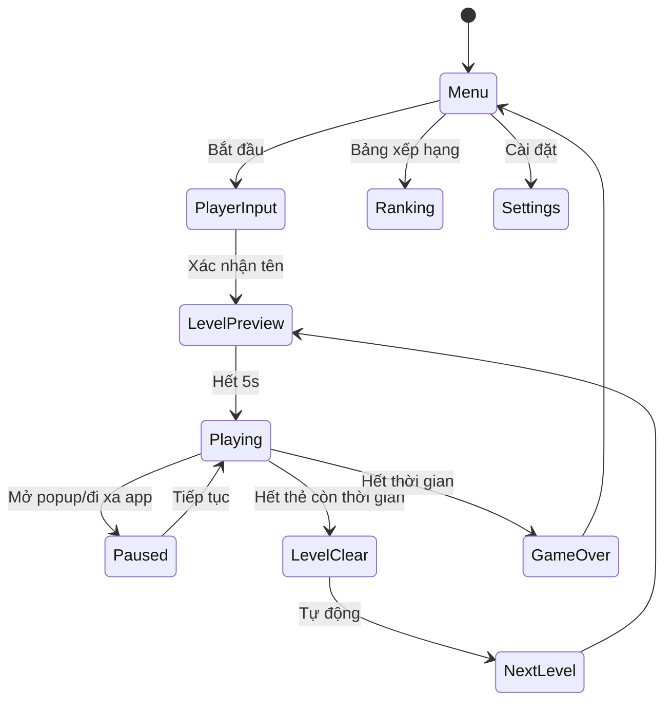
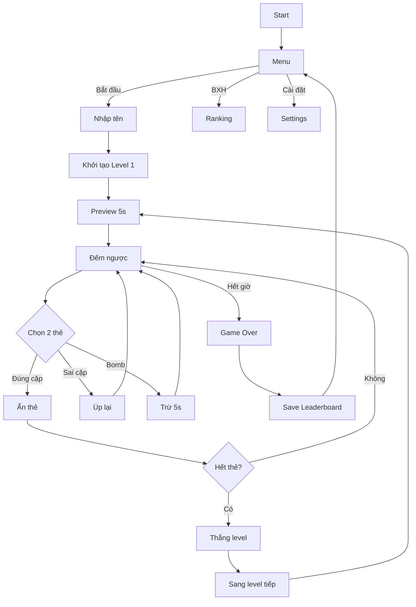

# Đề tài: Game Lật Thẻ (Bậc thầy trí tuệ)

Tài liệu gộp Giai đoạn Thiết kế + Phát triển cho game lật thẻ theo hướng OOP bằng Dart/Flutter. Tài liệu có thể sao chép sang Word để đạt độ dài 40–50 trang; phần nội dung đã được mở rộng chi tiết, kèm sơ đồ UML (Mermaid), giả mã/đoạn mã Dart minh họa, và quy trình phát triển.

---

## 1. Tổng quan đề tài

- **[mục tiêu]** Xây dựng game lật thẻ (Bậc thầy trí tuệ) với trải nghiệm mượt, giao diện đẹp (Dark/Light), âm thanh và hiệu ứng đầy đủ, có hệ thống level, bomb, trợ giúp và bảng xếp hạng.
- **[nền tảng]** Flutter (Dart) hướng tới thiết bị di động Android/iOS, có thể mở rộng Web/Desktop. Nếu thuần Dart (console) thì phần UI sẽ khác; tài liệu này giả định Flutter để bám sát thiết kế màn hình bạn đã mô tả.
- **[đối tượng người dùng]** Người chơi casual, mong muốn thử thách trí nhớ trong thời gian ngắn. 
- **[phạm vi]** Gameplay cốt lõi, 10 level, bomb theo cấp, 3 loại trợ giúp, âm thanh/hình ảnh cơ bản, lưu điểm cục bộ; có thể mở rộng dịch vụ đám mây sau.

---

## 2. Tóm tắt yêu cầu chức năng

- **[menu chính]** Logo, nền động theo theme, 3 nút: Bắt đầu, Bảng xếp hạng, Cài đặt.
- **[màn nhập tên]** Textbox bắt buộc, Lưu `{name, score=0, level=1}` và vào Level 1.
- **[màn chơi]**
  - Top bar: Tên, Level, Điểm, Đồng hồ đếm ngược.
  - Lưới thẻ PNG, quy tắc số thẻ: L1=4 (2 cặp) → … → L10=20; Bomb từ L4 (mỗi 2 level +1 bomb). 
  - Preview 5s tất cả thẻ khi bắt đầu, sau đó úp lại.
  - Lật 2 thẻ: đúng cặp → ẩn + âm thanh success; sai → úp + âm thanh fail; bomb → trừ 5s + âm thanh bomb.
  - Trợ giúp (tối đa 3/lv): +10s hiện tại (-15s lv sau), Xem toàn bộ 3s (-5s), Xóa 1 bomb (từ L4).
  - Thời gian: L1=30s, mỗi level +8s. Điểm: dựa vào đúng/sai và tốc độ.
- **[bảng xếp hạng]** Hai tab: theo điểm cao nhất, theo level cao nhất.
- **[cài đặt]** Theme Dark/Light (gif), âm thanh On/Off, font size.
- **[hiệu ứng/âm thanh]** Rung/hover, flip, success/fail, popup Game Over.

---

## 3. Phạm vi kỹ thuật và giả định

- **[SDK/IDE]** Flutter 3.x, Dart 3.x, Android Studio/VS Code.
- **[thiết bị mục tiêu]** Android API 21+, iOS 13+ (giả định), Web hỗ trợ sau.
- **[quản lý trạng thái]** `Provider`/`ChangeNotifier` để đơn giản và dễ hiểu cho đồ án OOP. Có thể thay bằng Riverpod/Bloc nếu cần.
- **[lưu trữ cục bộ]** `shared_preferences` cho cài đặt; `Hive` cho dữ liệu người chơi/leaderboard (nhanh, đơn giản). Nếu không dùng Hive, có thể serialize vào `shared_preferences` dạng JSON.
- **[âm thanh]** `audioplayers` plugin. Hình ảnh PNG tổ chức trong `assets/`.
- **[unit test]** `flutter_test`; có thể bổ sung `mocktail`.

---

## 4. Kiến trúc tổng thể

- **[pattern]** MVVM nhẹ + OOP: 
  - `Models`: `Player`, `Level`, `CardBase` (`NormalCard`, `BombCard`), `Settings`, `Leaderboard`.
  - `ViewModels` (hoặc `Controllers`): `GameController` điều phối trò chơi; `SettingsController`; `LeaderboardController`.
  - `Views`: `MainMenuScreen`, `PlayerInputScreen`, `GameScreen`, `RankingScreen`, `SettingsScreen`.
  - `Services`: `AudioService`, `StorageService`, `ThemeService`, `TimerService`.
- **[luồng dữ liệu]** View → Controller/ViewModel → Model → notifyListeners → View rebuild.
- **[routing]** `Navigator`/`GoRouter` (đơn giản dùng `Navigator.push`/`pop`).



---

## 5. Use cases chính

- **[UC1: Bắt đầu trò chơi]** Người chơi mở app → vào `MainMenu` → Bắt đầu → nhập tên → `GameScreen` Level 1.
- **[UC2: Chơi 1 level]** Preview 5s → đồng hồ đếm ngược → lật 2 thẻ theo luật → dùng trợ giúp nếu cần → thắng/thua.
- **[UC3: Dùng trợ giúp]** Tối đa 3/lv, áp hiệu ứng như mô tả.
- **[UC4: Xem bảng xếp hạng]** Theo điểm hoặc theo level.
- **[UC5: Cài đặt]** Chuyển theme, bật/tắt âm, chỉnh font.

---

## 6. Mô hình lớp (OOP)



---

## 7. Thiết kế màn hình chi tiết (UI/UX)

- **[MainMenu]** Logo trung tâm, nền động `light.gif`/`dark.gif`, 3 nút dạng cột bo góc, hover/ripple. 
- **[PlayerInput]** TextField bắt buộc; xác nhận → gọi `GameController.startNewGame(name)`.
- **[GameScreen]**
  - Top bar: `Text(currentPlayer.name)`, `Text('Lv $levelNumber')`, `Text('Score: $score')`, `Countdown`.
  - Grid: `GridView`/`GridView.count` theo số thẻ; ảnh PNG cho mặt trước; `back.png` cho mặt sau.
  - Trợ giúp: 3 nút nhỏ với icon, badge số lần còn lại; disable khi hết.
  - Popup `GameOver`/`LevelClear` với nút hành động.
- **[Ranking]** `TabBar` 2 tab: theo điểm, theo level; `ListView` hiển thị `name - score - level`.
- **[Settings]** `Switch` bật/tắt âm, `Slider` font, `SegmentedControl` theme.
- **[Accessibility]** Font scalable, màu sắc tương phản, haptic feedback nhẹ khi tương tác.

---

## 8. Quy tắc level, bomb, trợ giúp, thời gian, điểm

- **[level]** L1=4 thẻ → L10=20 thẻ. `baseCardCount` tăng theo cấp; công thức ví dụ: `min(2 + levelNumber, 10) * 2` nhưng cần khớp đúng dãy bạn yêu cầu (2 cặp → … → 10 cặp).
- **[bomb]** Từ L4 có 1 bomb; cứ mỗi 2 level +1 bomb (L6:2, L8:3, L10:4...).
- **[preview]** 5s; có thể hiện bằng `revealAll()` rồi `Timer` úp lại.
- **[thời gian]** `timeLimit = 30 + (level-1)*8 - pendingNextLevelTimePenaltyIfAny`.
- **[điểm]** Điểm dựa vào: số lần ghép đúng liên tiếp, thời gian còn lại, số lần lật sai. Công thức gợi ý:
  - Mỗi cặp đúng: +100.
  - Combo n: +20*n.
  - Sai: -10 (không âm dưới 0).
  - Thắng thưởng: +timeRemaining*5.
- **[trợ giúp]** Mỗi level tối đa 3 lần tổng, mỗi loại 0–3 tùy luật. Áp chế tài đúng mô tả: `+10s` hiện tại và ghi `pendingNextLevelTimePenalty += 15` cho level sau; `ShowAll` 3s rồi `timeRemaining -= 5`; `RemoveBomb` xóa 1 `BombCard`.

---

## 9. Luồng hoạt động và state machine



---

## 10. Thiết kế thuật toán và dữ liệu

- **[khởi tạo level]**
  1. Tính `baseCardCount` và `bombsCount` theo level.
  2. Tạo danh sách `NormalCard` theo cặp: sinh `pairId` theo biểu tượng/ảnh.
  3. Thêm `BombCard` với `penaltyTime=5`.
  4. Trộn `cards` (Fisher–Yates) và render `Grid`.
- **[xử lý lật thẻ]**
  - Giữ `firstSelected` và `secondSelected`.
  - Khi đủ 2: 
    - Nếu cùng `pairId` → đặt `isMatched=true` và ẩn; tăng `score`/combo; kiểm tra thắng.
    - Nếu bomb → `timeRemaining -= penaltyTime`; phát âm thanh; đặt lại chọn.
    - Nếu sai cặp → đợi 700ms, úp lại; combo reset, `score -= 10`.
- **[đồng hồ]** `Timer.periodic(1s)`: giảm `timeRemaining` nếu `state==Playing`.
- **[trợ giúp]** Kiểm tra quota, áp hiệu ứng, cập nhật UI tức thì.

---

## 11. Mã Dart minh họa (rút gọn)

Lưu ý: Đây là mẫu OOP + Provider, tính minh họa. Khi triển khai, tách file `models/`, `controllers/`, `services/`, `views/`.

```dart
// models/game_state.dart
enum GameState { menu, preview, playing, paused, levelClear, gameOver }

// models/card_base.dart
abstract class CardBase {
  final String id;
  bool isFaceUp;
  bool isMatched;
  CardBase({required this.id, this.isFaceUp = false, this.isMatched = false});
  void flip() => isFaceUp = !isFaceUp;
}

class NormalCard extends CardBase {
  final String pairId;
  NormalCard({required super.id, required this.pairId});
}

class BombCard extends CardBase {
  final int penaltyTime;
  BombCard({required super.id, this.penaltyTime = 5});
}

// models/player.dart
class Player {
  String name;
  int score;
  int highestLevel;
  Player({required this.name, this.score = 0, this.highestLevel = 1});
}

// models/level.dart
class Level {
  final int levelNumber;
  late int baseCardCount; // number of total cards, even number
  late int bombsCount;
  late int timeLimit;
  int timeRemaining = 0;
  int previewSeconds = 5;
  List<CardBase> cards = [];
  Map<HelpType, int> helpRemaining = {
    HelpType.extraTime: 1,
    HelpType.showAll: 1,
    HelpType.removeBomb: 1,
  };

  Level(this.levelNumber, {int pendingPenaltyNext = 0}) {
    baseCardCount = _calcCards(levelNumber);
    bombsCount = _calcBombs(levelNumber);
    timeLimit = 30 + (levelNumber - 1) * 8 - pendingPenaltyNext;
    timeLimit = timeLimit < 10 ? 10 : timeLimit;
    timeRemaining = timeLimit;
    _initCards();
  }

  int _calcCards(int lv) {
    // 2 cặp (4 thẻ) → tăng dần đến 10 cặp (20 thẻ)
    int pairs = (lv + 1).clamp(2, 10); // ví dụ
    return pairs * 2;
  }

  int _calcBombs(int lv) {
    if (lv < 4) return 0;
    return 1 + ((lv - 4) ~/ 2);
  }

  void _initCards() {
    final List<CardBase> list = [];
    final pairs = baseCardCount ~/ 2;
    for (int i = 0; i < pairs; i++) {
      final pid = 'P$i';
      list.add(NormalCard(id: 'C${i}A', pairId: pid));
      list.add(NormalCard(id: 'C${i}B', pairId: pid));
    }
    for (int b = 0; b < bombsCount; b++) {
      list.add(BombCard(id: 'B$b'));
    }
    list.shuffle();
    cards = list;
  }

  void revealAll(int seconds) {
    for (final c in cards) c.isFaceUp = true;
    // Hẹn giờ úp lại sau seconds (thực hiện ở controller)
  }
}

// models/help.dart
enum HelpType { extraTime, showAll, removeBomb }

abstract class Help { void use(Level level); }

class ExtraTimeHelp implements Help {
  final void Function(int nextLevelPenalty) onUsed;
  ExtraTimeHelp(this.onUsed);
  @override
  void use(Level level) {
    level.timeRemaining += 10;
    onUsed(15); // ghi phạt cho level kế tiếp
  }
}

class ShowAllHelp implements Help {
  @override
  void use(Level level) {
    level.revealAll(3);
    level.timeRemaining = (level.timeRemaining - 5).clamp(0, 9999);
  }
}

class RemoveBombHelp implements Help {
  @override
  void use(Level level) {
    final idx = level.cards.indexWhere((c) => c is BombCard);
    if (idx >= 0) level.cards.removeAt(idx);
  }
}

// models/leaderboard.dart
class Leaderboard {
  final List<Player> players = [];
  void addOrUpdate(Player p) {
    final idx = players.indexWhere((e) => e.name == p.name);
    if (idx >= 0) {
      players[idx] = p;
    } else {
      players.add(p);
    }
  }
  void sortByScore() => players.sort((a, b) => b.score.compareTo(a.score));
  void sortByLevel() => players.sort((a, b) => b.highestLevel.compareTo(a.highestLevel));
}

// controllers/game_controller.dart
import 'dart:async';
import 'package:flutter/foundation.dart';

class GameController extends ChangeNotifier {
  Player? currentPlayer;
  late Leaderboard leaderboard;
  late Settings settings;
  late Level currentLevel;
  GameState state = GameState.menu;
  int pendingNextLevelTimePenalty = 0;

  Timer? _timer;
  CardBase? _firstSelected;
  int _combo = 0;

  GameController({Leaderboard? lb, Settings? st}) {
    leaderboard = lb ?? Leaderboard();
    settings = st ?? Settings();
  }

  void startNewGame(String name) {
    currentPlayer = Player(name: name);
    pendingNextLevelTimePenalty = 0;
    startLevel(1);
  }

  void startLevel(int levelNumber) {
    currentLevel = Level(levelNumber, pendingPenaltyNext: pendingNextLevelTimePenalty);
    pendingNextLevelTimePenalty = 0; // consume
    state = GameState.preview;
    notifyListeners();

    // Preview 5s
    Future.delayed(const Duration(seconds: 5), () {
      state = GameState.playing;
      _startTimer();
      // Úp toàn bộ nếu đang lật sẵn
      for (final c in currentLevel.cards) { c.isFaceUp = false; }
      notifyListeners();
    });
  }

  void _startTimer() {
    _timer?.cancel();
    _timer = Timer.periodic(const Duration(seconds: 1), (_) => onTick());
  }

  void onTick() {
    if (state != GameState.playing) return;
    currentLevel.timeRemaining -= 1;
    if (currentLevel.timeRemaining <= 0) {
      endLevel(false);
    } else {
      notifyListeners();
    }
  }

  void onCardTapped(CardBase card) {
    if (state != GameState.playing) return;
    if (card.isMatched || card.isFaceUp) return;

    card.flip();
    notifyListeners();

    if (card is BombCard) {
      currentLevel.timeRemaining = (currentLevel.timeRemaining - card.penaltyTime).clamp(0, 9999);
      _firstSelected = null;
      _combo = 0;
      // play bomb sound
      return;
    }

    if (_firstSelected == null) {
      _firstSelected = card;
    } else {
      final first = _firstSelected!;
      _firstSelected = null;
      if (first is NormalCard && card is NormalCard && first.pairId == card.pairId) {
        // match
        Future.delayed(const Duration(milliseconds: 150), () {
          first.isMatched = true;
          card.isMatched = true;
          _combo += 1;
          currentPlayer!.score += 100 + 20 * _combo;
          notifyListeners();
          if (_allMatched()) {
            endLevel(true);
          }
        });
      } else {
        // not match
        _combo = 0;
        currentPlayer!.score = (currentPlayer!.score - 10).clamp(0, 999999);
        Future.delayed(const Duration(milliseconds: 700), () {
          first.isFaceUp = false;
          card.isFaceUp = false;
          notifyListeners();
        });
      }
    }
  }

  bool _allMatched() {
    return currentLevel.cards.whereType<NormalCard>().every((c) => c.isMatched);
  }

  void useHelp(HelpType type) {
    final remain = currentLevel.helpRemaining[type] ?? 0;
    if (remain <= 0) return;

    switch (type) {
      case HelpType.extraTime:
        ExtraTimeHelp((nextPenalty) { pendingNextLevelTimePenalty += nextPenalty; }).use(currentLevel);
        break;
      case HelpType.showAll:
        ShowAllHelp().use(currentLevel);
        Future.delayed(const Duration(seconds: 3), () {
          // Úp lại sau 3s
          for (final c in currentLevel.cards) { if (!c.isMatched) c.isFaceUp = false; }
          notifyListeners();
        });
        break;
      case HelpType.removeBomb:
        RemoveBombHelp().use(currentLevel);
        break;
    }

    currentLevel.helpRemaining[type] = remain - 1;
    notifyListeners();
  }

  void endLevel(bool win) {
    _timer?.cancel();
    if (win) {
      currentPlayer!.score += currentLevel.timeRemaining * 5;
      currentPlayer!.highestLevel = currentLevel.levelNumber > currentPlayer!.highestLevel
          ? currentLevel.levelNumber
          : currentPlayer!.highestLevel;
      state = GameState.levelClear;
      notifyListeners();
      Future.delayed(const Duration(seconds: 1), () {
        startLevel(currentLevel.levelNumber + 1);
      });
    } else {
      state = GameState.gameOver;
      leaderboard.addOrUpdate(currentPlayer!);
      notifyListeners();
    }
  }
}

// models/settings.dart
enum ThemeMode { light, dark }
class Settings {
  ThemeMode theme = ThemeMode.light;
  bool soundEnabled = true;
  double fontSize = 1.0; // scale factor
}
```

---

## 12. Dịch vụ hạ tầng (Services)

- **[AudioService]** Quản lý phát `flip.mp3`, `success.mp3`, `fail.mp3`, `bomb.mp3`. Tắt/mở theo `settings.soundEnabled`.
- **[StorageService]** Lưu/đọc `Settings`, `Leaderboard` (Hive hoặc `shared_preferences`).
- **[ThemeService]** Cấp `ThemeData` cho `ThemeMode.light/dark`, đặt nền gif tương ứng.
- **[TimerService]** Nếu muốn tách đồng hồ khỏi controller.

Ví dụ API:
```dart
abstract class StorageService {
  Future<void> savePlayer(Player p);
  Future<List<Player>> loadPlayers();
  Future<void> saveSettings(Settings s);
  Future<Settings> loadSettings();
}
```

---

## 13. Thiết kế dữ liệu lưu trữ

- **[Player]** `{ name: string, score: int, highestLevel: int }`
- **[Leaderboard]** `List<Player>` (unique theo name).
- **[Settings]** `{ theme: light|dark, soundEnabled: bool, fontSize: double }`
- **[Phiên chơi]** Không cần lưu chi tiết; chỉ cập nhật `Player` sau mỗi game.

---

## 14. Thiết kế bảng xếp hạng

- **[sắp xếp]** Hai chế độ: theo `score` và theo `highestLevel`.
- **[hiển thị]** `ListTile(title: name, subtitle: 'Lv $highestLevel', trailing: score)`.
- **[tính năng]** Xóa mục? Reset bảng? (tùy chọn nâng cao).

---

## 15. Thiết kế cài đặt

- **[theme]** `ThemeMode.light`/`dark`, ảnh nền gif tương ứng.
- **[âm thanh]** `Switch` → bật/tắt `AudioService`.
- **[font size]** `Slider` (0.8–1.4) → áp dụng `MediaQuery.textScaleFactor` hoặc `Theme`.

---

## 16. Tối ưu hiệu năng

- **[widget tái sử dụng]** Thẻ là `StatelessWidget` + input từ `CardBase`; rebuild theo `Selector` (Provider) để chỉ thẻ thay đổi mới vẽ lại.
- **[asset]** Dùng `cacheWidth/height` cho PNG; sprite sheet nếu cần.
- **[âm thanh]** Preload; không phát trùng lặp khi spam.
- **[logic]** Tránh setState diện rộng; debounce tương tác nhanh.

---

## 17. Khả năng mở rộng

- **[level động]** Đọc file JSON cấu hình level.
- **[skin/pack]** Bộ ảnh khác nhau cho cặp thẻ.
- **[nhiều chế độ]** Time Attack, Endless, Multiplayer.
- **[đám mây]** Firebase Auth + Firestore lưu leaderboard toàn cầu.

---

## 18. Bảo mật và an toàn

- **[chống cheat]** Không lưu trực tiếp biến điểm ở client trước khi kết thúc; xác thực khi lên cloud.
- **[quyền]** Chỉ cần truy cập âm thanh/tệp cục bộ; không yêu cầu quyền nhạy cảm.

---

## 19. Kiểm thử

- **[unit]** Kiểm thử `calcCards`, `calcBombs`, lật cặp đúng/sai, bomb trừ 5s, trợ giúp.
- **[widget]** Render `GameScreen`, bấm 2 thẻ → kỳ vọng.
- **[golden]** So sánh ảnh UI giữa Dark/Light.
- **[integration]** Flow hoàn chỉnh: Menu → Nhập tên → Chơi → Game Over → Leaderboard.

Ví dụ unit test ý tưởng:
```dart
test('ExtraTimeHelp adds time and next level penalty', () {
  final lv = Level(4);
  int nextPenalty = 0;
  ExtraTimeHelp((p) => nextPenalty += p).use(lv);
  expect(lv.timeRemaining, greaterThan(lv.timeLimit));
  expect(nextPenalty, 15);
});
```

---

## 20. CI/CD và đóng gói

- **[CI]** GitHub Actions: `flutter analyze`, `flutter test`.
- **[CD]** Tạo `apk` debug/release; iOS via Xcode (nếu cần). Web build tách biệt.
- **[assets]** Khai báo trong `pubspec.yaml`. Kiểm tra giấy phép âm thanh/hình.

---

## 21. Kế hoạch phát triển theo giai đoạn

- **[Giai đoạn 1: Khung dự án]** Tạo project Flutter, cấu trúc thư mục, pubspec, assets placeholder.
- **[Giai đoạn 2: Models]** Player, Level, CardBase, Help, Leaderboard, Settings.
- **[Giai đoạn 3: Controller]** GameController với state, timer, logic thẻ, trợ giúp.
- **[Giai đoạn 4: UI]** MainMenu, PlayerInput, GameScreen (Grid, Topbar, Helps), Ranking, Settings.
- **[Giai đoạn 5: Services]** Audio, Storage; tích hợp Settings và Leaderboard.
- **[Giai đoạn 6: Hoàn thiện]** Âm thanh/hiệu ứng, tối ưu, test, bugfix.
- **[Giai đoạn 7: Phát hành]** Build, ký, tài liệu người dùng.

---

## 22. Rủi ro và phương án xử lý

- **[hiệu năng thấp trên máy yếu]** Giảm kích thước PNG, giảm hiệu ứng.
- **[logic bug trùng khớp]** Viết test case, log bước so khớp.
- **[âm thanh trễ]** Preload và giữ 1 instance player.
- **[leaderboard trùng tên]** Cho phép cùng tên, nhưng sắp xếp theo score; hoặc enforce unique.

---

## 23. Phụ lục A: Sơ đồ hoạt động (chi tiết)



---

## 24. Phụ lục B: Phân tích điểm số (gợi ý công thức)

- **[cặp đúng]** +100 điểm
- **[combo]** +20 x combo hiện tại
- **[sai]** -10 điểm (không âm)
- **[thắng]** +5 x thời gian còn lại
- Có thể tinh chỉnh để độ khó/điểm phù hợp thực nghiệm.

---

## 25. Phụ lục C: Danh mục tài nguyên

- `assets/images/cards/` ảnh PNG mặt trước theo `pairId`
- `assets/images/back.png` mặt sau
- `assets/images/light.gif`, `assets/images/dark.gif` nền
- `assets/audio/flip.mp3`, `assets/audio/success.mp3`, `assets/audio/fail.mp3`, `assets/audio/bomb.mp3`

Khai báo trong `pubspec.yaml`:
```yaml
flutter:
  assets:
    - assets/images/
    - assets/audio/
```

---

## 26. Kết luận

Tài liệu đã gộp chi tiết Thiết kế + Phát triển cho game lật thẻ “Bậc thầy trí tuệ” theo OOP trong Dart/Flutter: từ yêu cầu, UI/UX, mô hình lớp, thuật toán, quản lý trạng thái, lưu trữ, kiểm thử đến kế hoạch triển khai.
